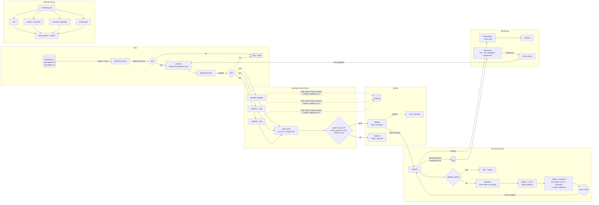

# System Architecture

## Components and tools

| Role | Tool | Why |
|---|---|---|
| Version control | Git + GitHub (branch + PR) | Required; commit history is used for individual grading |
| Containerization | Docker + docker compose | One image for API and trainer, so transform code is shared |
| Data validation | Custom (`src/data/validate.py`) | Images + YOLO labels don't fit table-oriented tools like GE/Pandera |
| Experiment tracking | MLflow Tracking | Records all 6 items and compares runs in the UI |
| Model registry | MLflow Registry (aliases + tags) | `champion`/`previous` aliases make rollback one command |
| Orchestration | Prefect 3 | Runs on Windows, lighter than Airflow, has a UI that shows the DAG |
| Serving | FastAPI + Uvicorn | Simple, automatic docs at `/docs`, easy to add endpoints |
| Monitoring | Prometheus + Grafana + custom drift checks | System metrics + PSI/KS for data drift + feedback for concept drift |
| CI/CD | GitHub Actions | 5 jobs: lint, tests, data validation, model gate, docker |
